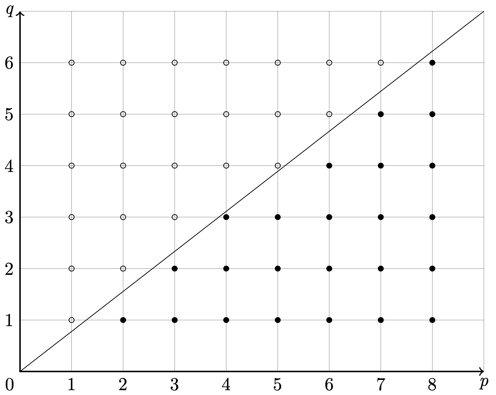

# 数论

[TOC]

## 整除

**Definition**	设整数 $a, b$，若存在整数 $m$，使得 $b = ma$ 成立，则称 **$a$ 整除 $b$**，并记 $a \ \mid b$.

## 整数

**算术基本定理**	对于任意正整数 $n \geq 2$，都存在一些素数 $p_1, p_2, \cdots, p_k$ 和正整数 $\alpha_1, \alpha_2, \cdots, \alpha_k$，其中 $k \geq 1$，使得 $n$ 可以表示成 $n = p_1^{\alpha_1} p_2^{\alpha_2} \cdots p_k^{\alpha_k}$. 且这种形式除了顺序外是唯一的.

## 同余

**Definition（同余）**	对于正整数 $m$ 和整数 $a, b$，如果 $m \mid a - b$ 成立，则称 $a$ 与 $b$ 模 $m$ 同余，记为 $a \equiv b \ (\mathrm{mod}\ m)$.

**Definition（同余类）**	我们称集合 $\{ x \mid x \equiv a \ (\mathrm{mod}\ m) \}$ 为**模 $m$ 余 $a$ 的同余类**.

**Definition（完系、缩系）**	设集合 $A = \{ x_1, x_2, \cdots x_m \}$ 中每个数模 $m$ 互不同余，我们称这样的集合为模 $m$ 的一个**完全剩余系**（简称**完系**）；称集合 $\{ x \in A \mid (x, m) = 1 \}$ 为模 $m$ 的一个**缩完全剩余系**（简称**缩系**）.

完系和缩系有如下性质：

若 $\{ x_1, x_2, \cdots, x_m \}$ 为模 $m$ 的完系，且 $(a, m) = 1$，则  $\{ a x_1 + b, a x_2 + b, \cdots, a x_m + b \}$ 仍为模 $m$ 的完系.

若 $\{ x_1, x_2, \cdots, x_{\varphi(m)} \}$ 为模 $m$ 的缩系，且 $(a, m) = 1$，则  $\{ a x_1, a x_2, \cdots, a x_{\varphi(m)} \}$ 仍为模 $m$ 的缩系.

### 逆

**Theorem**	设整数 $a, m$ 且互素，则存在整数 $x^{-1}$，使得 $x x^{-1} \equiv 1 \ (\mathrm{mod}\ m)$ 成立.

> **Proof**	设集合 $A = \{ 0, a, \cdots, (m-1)a \}$，由于 $a, m$ 互素，集合 $A$ 为模 $m$ 的一个完系，因此必存在整数 $x^{-1}$，有 $x x^{-1} \equiv 1 \ (\mathrm{mod}\ m)$. $\blacksquare$

因此 $a$ 模 $m$ 的逆存在，且易知其在模意义下唯一. 所以我们能给出如下定义

**Definition（逆）**	若整数 $a, m$ 互素，则存在整数 $x^{-1}$，使得 $x x^{-1} \equiv 1 \ (\mathrm{mod}\ m)$ 成立. 我们称 $x^{-1}$ 为 $x$ 模 $m$ 的**逆**.

### 一些定理

**欧拉定理**	设 $a, m$ 互素，则$a^{\varphi(m)} \equiv 1 \ (\mathrm{mod}\ p)$.

> **Proof**	设 $A = \{ x_1, x_2, \cdots, x_{\varphi(m)} \}$ 为模 $m$ 的缩系，由缩系的性质，$B = \{ a x_1, a x_2, \cdots, a x_{\varphi(m)} \}$ 仍为模 $m$ 的缩系，因此
> $$
> \prod_{x \in A} x = \prod_{x \in B} x
> $$
> 
>
> 由缩系的定义，$x_1, x_2, \cdots, x_{\varphi(m)}$ 均与 $m$ 互素. 上式约去 $x_1 x_2 \cdots x_{\varphi(m)}$ 即可. $\blacksquare$

**费马小定理**	设 $p \nmid a$，则$a^{p-1} \equiv 1 \ (\mathrm{mod}\ p)$.

> **Proof**	显然 $\varphi(p) = p - 1$，由欧拉定理既得. $\blacksquare$

**Wilson 定理**	$(p-1)! \equiv -1 \ (\mathrm{mod}\ p)$ $\Leftrightarrow$ $p$ 是素数.

> **Proof**	充分性：反正，若 $p$ 不是素数，则 $p$ 由素因子 $q$，且 $1 < q \leq p - 1$，因此
> $$
> (p-1)! \equiv 0 \not\equiv -1 \ (\mathrm{mod}\ q)
> $$
> 矛盾！
>
> 必要性：集合 $A = \{ 1, 2, \cdots, p-1 \}$ 中各个元素均有逆，且无 2 个元素的逆模 $p$ 相同. 由方程 $x^2 \equiv 1 \ (\mathrm{mod}\ p)$ 的解（模意义下唯一）为 $x = 1, p-1$. 也就是说，集合 $A$ 中的数除 $1, p-1$ 外两两配对，相乘模 $p$ 后同余于 $1$. 所以
> $$
> \prod_{x \in A} x \equiv 1 \cdot (-1) = -1 \ (\mathrm{mod}\ p)
> $$
> 结论得证. $\blacksquare$

**中国剩余定理**	若正整数 $m_1, m_2, \cdots, m_n$ 两两互素，则同余方称组
$$
\left\{ \begin{aligned}

x &\equiv a_1 \ (\mathrm{mod}\ m_1) \\
x &\equiv a_2 \ (\mathrm{mod}\ m_2) \\
  &\vdots \\
x &\equiv a_n \ (\mathrm{mod}\ m_n)

\end{aligned} \right.
$$
有解，且其解可构造为 $x \equiv \sum_{i=1}^{n} a_iM_i^{-1}M_i \ (\mathrm{mod}\ M)$，其中 $M = \prod_{j=1}^{n} m_j$，$M_i = M / m_i$，$M_i^{-1}$ 为 $M_i$ 模 $m_i$ 的逆.

> **Proof**	由构造的解可知方程组有解 $x_0$. 则由同余方程组，必有对任意 $i = 1, 2, \cdots, n$，$x \equiv x_0 \ (\mathrm{mod}\ m_i)$. 由于 $m_1, m_2, \cdots, m_n$ 两两互素，故可得 $x \equiv x_0 \ (\mathrm{mod}\ M)$. 易知满足该式的解 $x$ 也满足方程组，因此我们构造出了方程组的所有解. $\blacksquare$

**Lucas 定理**	设素数 $p$，在 $p$ 进制下正整数 $a = (a_k a_{k-1} \cdots a_0)_p$，$b = (b_k b_{k-1} \cdots b_0)_p$（首个数可为 $0$），则
$$
C_a^b \equiv C_{a_k}^{b_k} C_{a_{k-1}}^{b_{k-1}} \cdots C_{a_0}^{b_0} \ (\mathrm{mod}\ p)
$$

> **Proof**	易知
> $$
> a = a_k p^k + a_{k-1} p^{k-1} + \cdots + a_0 \\
> b = b_k p^k + b_{k-1} p^{k-1} + \cdots + b_0
> $$
>
> **Lemma**	$(1 + x)^{p^k} \equiv 1 + x^{p^k} \ (\mathrm{mod}\ p)$.
>
> > **Lemma Proof**	由二项式定理
> > $$
> > (1 + x)^{p^k} = \sum_{i=0}^{p^k} C_{p^k}^{i} x^i
> > $$
> > 对任意 $0 < i < p^k$，$i + (p^k - i) = p^k = (10 \cdots 0)_p$，从而 $i$ 加 $p^k - i$ 在 $p$ 进制下必定产生进位，由 **Kummer 定理**，$v_p(C_{p^k}^{i}) \geq 1$. 因此对任意 $0 < i < p^k$，$C_{p^k}^{i} \equiv 0 \ (\mathrm{mod}\ p)$，结论得证. $\square$
>
> 由引理，可知
> $$
> \begin{aligned}
> 
> (1 + x)^a
> & = (1+x)^{a_0} ((1+x)^p)^{a_1} \cdots ((1+x)^{p^k})^{a_k} \\
> & \equiv (1+x)^{a_0} (1+x^p)^{a_1} \cdots (1+x^{p^k})^{a_k}
> \ (\mathrm{mod}\ p)
> 
> \end{aligned}
> $$
> 利用任意进制数的表示的唯一性，比较两边 $x^b$ 的系数即可. $\blacksquare$

## 阶

*「本章的定义和定理中，除非有明确指出，否则默认 $m \in \N_+$，$a \in \Z$.」*

**Definition（阶）**	若存在正整数 $r$，使得 $a^r \equiv 1 \ (\mathrm{mod}\ p)$ 成立，我们称具有这样性质的最小正整数 $r$ 为 **$a$ 模 $m$ 的阶**（简称**阶**），并记 $r = \delta_m (a)$.

**Theorem**	$(a, m) = 1$ $\Leftrightarrow$ $a$ 有模 $m$ 的阶.

> **Proof**	充分性：由欧拉定理既得；
>
> 必要性：证明其逆否命题，只需证若 $(a, m) \neq 1$ 时，若 $a$ 有模 $m$ 的阶会产生矛盾.
>
> 此时可取素因子 $p \mid (a, m)$，若 $a$ 有模 $m$ 的阶 $r$，则 $p \mid (a^r - 1)$，即 $p \mid 1$ 矛盾！$\blacksquare$

由这个定理，我们规定：以后只要出现某个数为某个数的阶，则暗含着它们的互素关系.

**Theorem**	$1 \leq \delta_m (a) \leq \varphi(m)$.

> **Proof**	由欧拉定理既得. $\blacksquare$

### 原根

**Definition**	若 $\delta_m (a) = \varphi(m)$，则称 $a$ 是模 $m$ 的一个**原根**（$m$ 有原根）.

**Theorem**	设素数 $p$，则模 $p$ 的原根存在.

**Proof**

**Theorem**	设素数 $p$，正整数 $k$，则模 $p^k$ 的原根存在.

**Proof**

### 升幂引理

**升幂引理1**	设 $x, y \in \Z$，$n \in \N_+$，$p$ 为奇素数，且 $p \mid (x-y)$，$(p, xy) = 1$. 则
$$
v_p(x^n - y^n) = v_p(x-y) + v_p(n)
$$

**Proof**

**升幂引理2**	设 $x, y$ 为奇数，$n$ 为偶数. 则
$$
v_2(x^n - y^n) = v_2(x-y) + v_2(x+y) - 1
$$

**Proof**

**升幂引理3**	设 $x, y$ 为奇数，且 $4 \mid (x-y)$. 则
$$
v_2(x^n - y^n) = v_2(x-y) + v_2(n)
$$

**Proof**

[1]: https://en.wikipedia.org/wiki/Lifting-the-exponent_lemma	"Lifting-the-exponent lemma - Wikipedia"
[2]: https://zhuanlan.zhihu.com/p/106900309	"升幂定理(LTE) - 知乎"

[^3]: 数学奥林匹克小丛书（第三版），高中卷 15 数论，第 8 章例 5（第 59 页）

## 二次剩余

**Definition**	如果对于互素整数 $a, m$，同余式 $x^2 \equiv a \ (\mathrm{mod}\ m)$ 有解，则称 $a$ 为模 $m$ 的二次剩余；否则称 $a$ 为模 $m$ 的二次非剩余.

**Definition（勒让德符号）**	$p$ 是奇素数，$p \nmid a$，记
$$
\left( \frac{a}{p} \right) = \left\{ \begin{aligned}

1  & & a \ \text{是模}\ p \ \text{的二次剩余} \\
-1 & & a \ \text{是模}\ p \ \text{的二次非剩余} \\

\end{aligned} \right.
$$
**Theorem（欧拉判别法）**	$p$ 是奇素数，$p \nmid a$，则
$$
\left( \frac{a}{p} \right) \equiv a^{\frac{(p-1)}{2}} \ (\mathrm{mod}\ p)
$$

> **Proof**	一方面，若 $\left( \dfrac{a}{p} \right) = 1$，则存在 $x$，使得 $x^2 \equiv a \ (\mathrm{mod}\ p)$ 成立，易知 $(x, p) = 1$，此时由费马小定理，
> $$
> a^{\frac{(p-1)}{2}} \equiv (x^2)^{\frac{(p-1)}{2}} = x^{p-1} \equiv 1 = \left( \dfrac{a}{p} \right) \ (\mathrm{mod}\ p)
> $$
> 另一方面，若 $\left( \dfrac{a}{p} \right) = -1$，则由 $x^2 \not\equiv a \ (\mathrm{mod}\ p)$ 恒成立知，对任意 $p \nmid x$，$x$ 模 $p$ 的逆 $x^{-1}$ 存在且在模意义下唯一，并且由于 $x \cdot a x^{-1} \equiv a \ (\mathrm{mod}\ p)$，因此 $x \not\equiv ax^{-1} \ (\mathrm{mod}\ p)$，所以对于模 $p$ 的缩系，其元素总是两两配对且相乘模 $p$ 同余于 $a$. 因此由 **Wilson 定理**知，
> $$
> a^{\frac{(p-1)}{2}} \equiv (p-1)! \equiv -1 = \left( \dfrac{a}{p} \right) \ (\mathrm{mod}\ p)
> $$
> 综上，结论成立. $\blacksquare$

#### 二次互反律

**Theorem（二次互反律）**	$p$ 和 $q$ 是不相等的奇素数，则
$$
\left( \frac{p}{q} \right) \left( \frac{q}{p} \right) = (-1)^{\frac{p-1}{2} \frac{q-1}{2}}
$$

###### Max Eisenstein 的证明

**Lemma (Gauss)**	$\left( \dfrac{a}{p} \right) = (-1)^s$，其中为 $p$ 奇素数，$a$ 和 $p$ 互素，$s$ 为 $a, 2a, \cdots, \dfrac{p-1}{2} a \ (\mathrm{mod}\ p)$ 中大于 $\dfrac{p}{2}$ 的个数.

> **Proof**	设 $a, 2a, \cdots, \dfrac{p-1}{2} a \ (\mathrm{mod}\ p)$ 为 $b_1, b_2, \cdots, b_t, c_1, \cdots, c_s$，其中 $b_i \leq \dfrac{p}{2} \leq c_j$.
>
> 下面证明 $b_1, b_2, \cdots, b_t, p - c_1, \cdots, p - c_s$ 两两不等. 若不然，假设有2个数相等，则必然是 $b_i = p - c_j$，即 $b_i + c_j = p$，可得 $Aa \equiv 0 \ (\mathrm{mod}\ p)$，其中 $1 \leq A \leq p-1$，矛盾！
>
> 故 $\{ b_1, b_2, \cdots, b_t, p - c_1, \cdots, p - c_s \} = \left\{ 1, 2, \cdots, \dfrac{p-1}{2} \right\}$，所以
> $$
> \begin{aligned}
> 
> (-1)^s b_1 b_2 \cdots b_t c_1 \cdots c_s
> &\equiv b_1 b_2 \cdots b_t (p - c_1) \cdots (p - c_s) \\
> &= \left( \frac{p-1}{2} \right)!
> \ (\mathrm{mod}\ p)
> 
> \end{aligned}
> $$
> 又因为
> $$
> b_1 b_2 \cdots b_t c_1 \cdots c_s
> \equiv a^{\frac{p-1}{2}} \left( \frac{p-1}{2} \right)!
> \ (\mathrm{mod}\ p)
> $$
> 且 $p \nmid \left( \dfrac{p-1}{2} \right)!$，所以消去 $b_1 b_2 \cdots b_t c_1 \cdots c_s$ 得 $(-1)^s a^{\frac{p-1}{2}} \equiv 1 \ (\mathrm{mod}\ p)$，即 $a^{\frac{p-1}{2}} \equiv (-1)^s \ (\mathrm{mod}\ p)$，由**欧拉判别法**可得 $\left( \dfrac{a}{p} \right) = (-1)^s$. $\blacksquare$

下面这个引理进一步的给出了 $\left( \dfrac{a}{p} \right)$ 的计算方法.

**Lemma (Max Eisenstein)**	$\left( \dfrac{a}{p} \right) = (-1)^{T(a, p)}$，其中为 $p$ 奇素数，$a$ 和 $p$ 互素，$T(a, p)= \sum_{i=1}^{\frac{p-1}{2}} \left\lfloor \dfrac{ia}{p} \right\rfloor$.

> **Proof**	用**高斯引理**证明中的符号.
>
> 注意到由带余除法，$ia = \left\lfloor \dfrac{ia}{p} \right\rfloor p + r$，其中 $1 \leq r \leq p-1$，且 $ia \equiv r \ (\mathrm{mod}\ p)$. 因此
> $$
> b_1 + b_2 + \cdots + b_t + c_1 + \cdots + c_s = \sum_{i=1}^{\frac{p-1}{2}} \left(ia - \left\lfloor \dfrac{ia}{p} \right\rfloor p \right)
> $$
> 而
> $$
> \begin{aligned}
> 
> &b_1 + b_2 + \cdots + b_t - c_1 - \cdots - c_s + sp \\
> =& b_1 + b_2 + \cdots + b_t + (p - c_1) + \cdots + (p - c_s) \\
> =& \sum_{i=1}^{\frac{p-1}{2}} ia
> 
> \end{aligned}
> $$
> 两式相减，得
> $$
> sp - 2(c_1 + c_2 + \cdots + c_s) = \sum_{i=1}^{\frac{p-1}{2}} \left\lfloor \dfrac{ia}{p} \right\rfloor p = p T(a, p)
> $$
> 因为 $-1$ 模 $p$ 的阶为 $2$，而上式模 $2$ 得 $s \equiv T(a, p) \ (\mathrm{mod}\ 2)$，因此由**高斯引理**，$\left( \dfrac{a}{p} \right) = (-1)^s = (-1)^{T(a, p)}$，结论得证. $\blacksquare$

> **Final Proof (Max Eisenstein)**	由 **Max Eisenstein 的引理**有
> $$
> \left( \dfrac{q}{p} \right) = (-1)^{T(q, p)}
> \qquad
> \left( \dfrac{p}{q} \right) = (-1)^{T(p, q)}
> $$
> 其中 $T(a, p)= \sum_{i=1}^{\frac{p-1}{2}} \left\lfloor \dfrac{ia}{p} \right\rfloor$. 注意到 $T(q, p)$ 的几何意义是 $x \in \left[ 1, \dfrac{p}{2} \right)$ 时 $py = qx$ 与 $x$ 轴之间的整点个数，而在同一个坐标轴中，$T(p, q)$ 的几何意义是 $y \in \left[ 1, \dfrac{q}{2} \right)$ 时 $px = qy$ 与 $y$ 轴之间的整点个数，由于在 $x \in \left[ 1, \dfrac{p}{2} \right), y \in \left[ 1, \dfrac{q}{2} \right)$ 中 $px = qy$ 无整数解，即此区间内直线上无整点，因此 $T(q, p) + T(p, q)$ 为 $x \in \left[ 1, \dfrac{p}{2} \right), y \in \left[ 1, \dfrac{q}{2} \right)$ 中的所有整点个数，即
> $$
> T(q, p) + T(p, q) = \frac{p-1}{2} \frac{q-1}{2}
> $$
> 所以
> $$
> \left( \frac{p}{q} \right) \left( \frac{q}{p} \right) = (-1)^{\frac{p-1}{2} \frac{q-1}{2}}
> $$
> 结论得证. $\blacksquare$

上面证明中最后的例子可以参考下面这张图（$p = 17, q = 13$），其中实心点代表 $T(q, p)$ 部分，空心点代表 $T(p, q)$ 部分.

[^1]: https://www.zhihu.com/question/59572768/answer/254653900 如何简洁地证明二次互反律？有哪些具体应用？
[^2]: https://zhuanlan.zhihu.com/p/54855092 浅谈二次互反律

